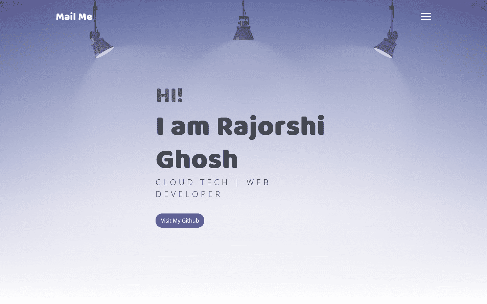

## Description

A student portfolio with functional form submission

## Screenshots



## Installation

Follow these steps to get started with the project:

1. **Clone the repository:**

   ```bash
   git clone https://github.com/folliejester/portfolio.git

2. **Edit the files**

   Edit the index.html, assets/js/script.js, assets/css/style.js files as per your need and the images in assets/imgs/ too.

3. **Cloudflare worker**

   Create a cloudflare account, create a new worker (under worker and pages), and copy paste the worker.js codes in there with your own details

4. **Create a sendgrid account**

   Add your domain, verify, and create an api key. Put that api key in worker.js and deploy the worker. You can also use smtpjs if you have your own smtp server or want to use your existing mail service.

5. **Cloudflare pages**

   Deploy the html css js codes from your github repo to cloudflare pages or do it manually.
